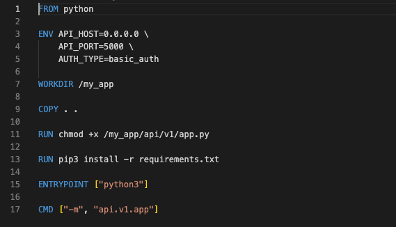
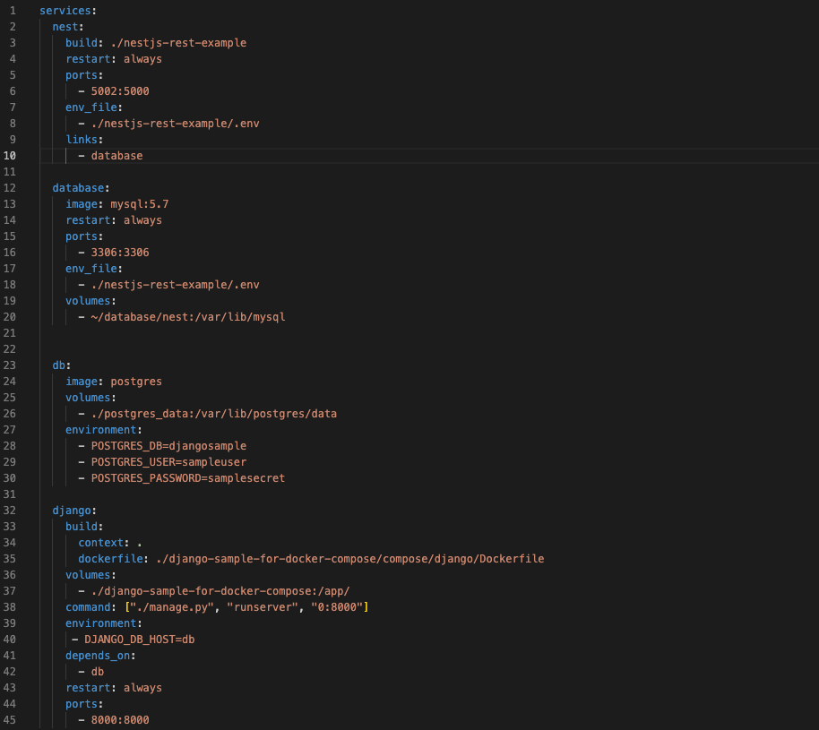

<h1>To run a simple application using docker</h1>
<h2>Steps</h2>
<ul>
   <li>Firstly a simple API was created using python Flask as the framework</li>
   <li>
      Next a docker file containing the specifications for the required image was created.
      
The image below shows the docker file

      
      
Dockerfile -> (https://github.com/Timi-T/nautilus-devops/blob/main/0x04-week/Task-1-2/Dockerfile)

      <ul>
         <li>Line 1: Describes the image on which conatiner is based on</li>
         <li>Line 3: Describes the environment varaibles required for the app</li>
         <li>Line 7: Describes the working directory to execute commands from in the container</li>
         <li>Line 9: Copies every file and folder from the current directory in my local machine into the working directory in the container</li>
         <li>Line 11: Runs a command to change the file permissions of the python module</li>
         <li>Line 13: Runs a command to install all required dependencies for the application</li>
         <li>Line 15: Describes the entry point for the command on line 17</li>
         <li>line 17: Runs the command to start the application</li>
      </ul>
   </li>
   <li>Next the image for the container was built using the command "docker build -t [image_name]:[image_version] [directory for docker file]"</li>
   <li>
      Finally the image was pushed to docker hub using the following steps:
      <ul>
         <li>docker login -> To login to docker hub</li>
         <li>docker tag [image_name]:[image_version] [username]:[repository_name] -> To tag the image to a repository.</li>
         <li>docker push [repository_name]:[image_name] -> To push the image to docker hub.</li>
      </ul>
   </li>
</ul>
<li>Link to docker image -> (https://hub.docker.com/repository/docker/roadsidedev/nautilus-devops)</li>

<h1>Steps taken to run two docker applications and serve using nginx and docker-compose</h1>
<ul>
   <li>Firstly, a django and nest applications was cloned from the specified github repository</li>
   <li>
      Next a docker-compose file was created to automate creating and running containers for the application
      
      
Docker-compose file -> (https://github.com/Timi-T/nautilus-devops/blob/main/0x04-week/Task-3/docker-compose.yml)

   </li>
   <li>Next the composible file was activated to run the containers for the applications using the command "docker-compose up -d"</li>
   <li>
      Next nginx on localhost was configured to direct traffic to the containers based on the specified url
      <ul>
         <li>localhost:3000/django -> routes to the django container</li>
         <li>localhost:3000/nest -> routes to the nest container</li>
      </ul>
      
      
Nginx config file -> (https://github.com/Timi-T/nautilus-devops/blob/main/0x04-week/nginx.conf)

   </li>
</ul>