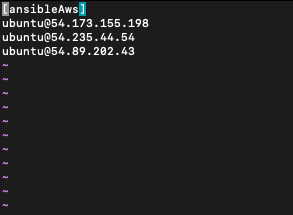
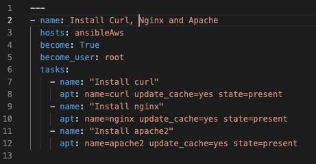

<h1>Ansible</h1>

    Ansible is an automation tool used to setup IT infrastructure with simple written human readable lines of instructions. It is used for application deployment, configuration management and ochestration of infrastructure.
    Ansible connects to remote nodes to be configured using ssh. The nodes are registered in a file on the manager node in the location "/etc/ansible/hosts". Ansible does not require any agents on the remote nodes, it only sends out modules viia ssh to the remote nodes, runs the modules and deletes them when finished.

<h2>Steps taken to Install Nginx, Apache and curl on 3 node machines using Ansible</h2>
<ul>
    <li>Firstly Ansible was installed on my local machine. This would be the manager node</li>
    <li>Then three Ubuntu remote nodes were created o AWS cloud platform.</li>
    <li>
        Next the IPv4 addresses for each of the remote nodes were registered in a group "ansibleAws" in the file "/etc/ansible/hosts".
        
    </li>
    <li>
        Next an ansible playbook was created to provision each remote node server with Nginx, Apache and Curl.
        
        <ul>
            <li>Line 2: Describes the name of the playbook.</li>
            <li>Line 3: Describes the hosts (ansibleAws) to provision.</li>
            <li>Line 4: Allows for privilege escalation.</li>
            <li>Line 5: Runs commands as the root user.</li>
            <li>Line 6: Describes the tasks to be carried out</li>
            <li>Line 7: The name of the task to be carried out is created</li>
            <li>
                Line 8 - 12: Using package manager for ubuntu linux (apt)
                <ul>
                    <li>name: describes the name of the package to be installed (curl, nginx and apache)</li>
                    <li>update_cache: Updates the package manager (apt) before installation of a package when set to yes.</li>
                    <li>state: Describes the desired state for the package in the node machines.</li>
                </ul>
            </li>
        </ul>
    </li>
</ul>
