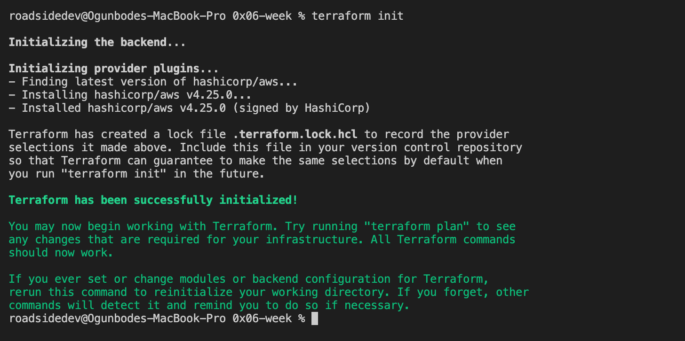
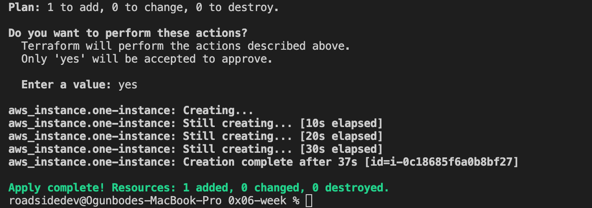
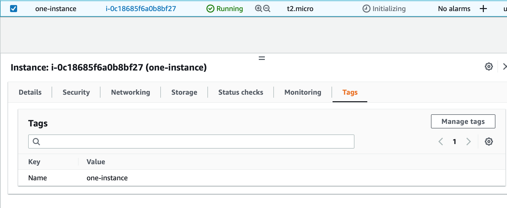
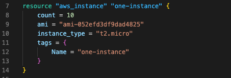
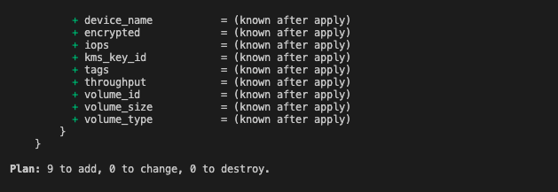
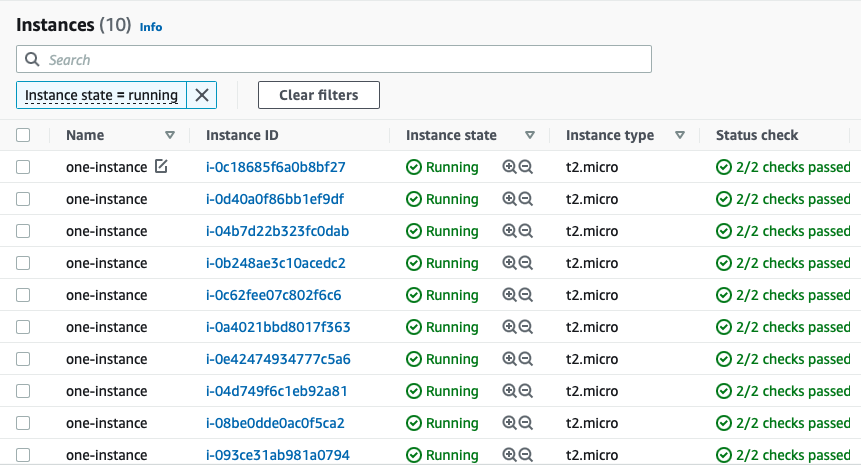
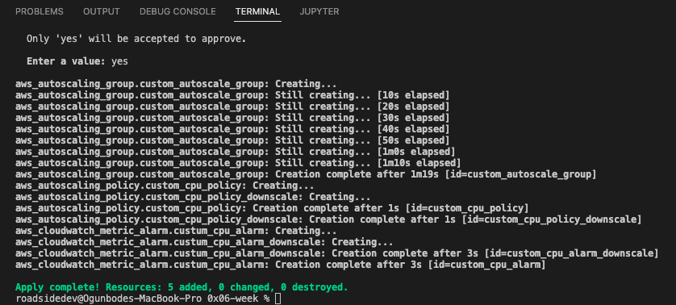
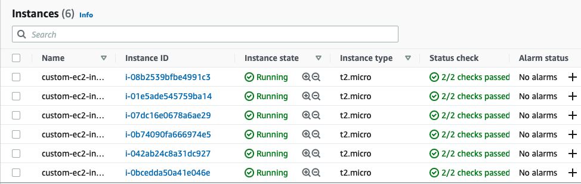
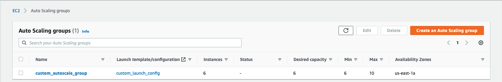

<h1>Infrastructure as code (Terraform & Packer)</h1>
<ul>
  <li>
    

      Infrastructure as code (IaC) is a term used to describe the process of provisioning and configuration of an IT infrastructure using configuration files.
      The configuration files generally includes line by line instructions to be carried out in order to have the whole infrastructure setup.
      This has greatly improved the efficiency of companies because now as opposed to manual configuration which would take hours or even days in some cases businesses can upscale and downscale using simple configuration files. This method goes as far as using cloud provider APIs to setup cloud infrastructures.
      Infrastructure as code manages the state of an infrastructure using the configuration file so that any change in the file updates the state of the said infrastructure.
    

  </li>
  <li>
    
To launch an aws instance using Terraform

    <ul>
      <li>Firstly, the cloud provider is declared (AWS) in this case.</li>
      <li>
        Next, I generated a secret key in my AWS account which would Authorize terraform to carry out operations on the account
      </li>
        Next, the resource was declared (asw_instance) in this case with the instance properties.
      <li>
        Next, run command "terraform init". This downloads the plugins for each provider that is declared.
        
      <li>
      <li>
        Next, run command "terraform plan". This parses the terraform manifest and gives an output of all changes to be made to the state of your infrastructure before the changes are applied.
        
        (Full output of command -> https://github.com/Timi-T/nautilus-devops/blob/main/0x06-week/terra-plan.md)
      </li>
      <li>
        Finally, run command "terraform apply". This applies all the changes to the state of the infrastructure.
        
      </li>
    </ul>
    
Below, we see the running instance "one-instance" on AWS platform

    
    Terraform manifest 1: (https://github.com/Timi-T/nautilus-devops/blob/main/0x06-week/one-instance.tf)
  </li>
  <li>
    <h2>Create 10 aws instances using terraform</h2>
    
Terraform manifest 2: (https://github.com/Timi-T/nautilus-devops/blob/main/0x06-week/ten-instances.tf) 

    

      Just like in the previous example, everythiing remains the same except that for this case, a new parameter is added to the resource block. A count parameter is introduced to specify the number of intsnces to be created.
    

    
    

      When "terraform plan" command is run on this script, something interesting happens. The number of instances to be added becomes 9. "Why?" you may ask. Well remember i said earlier that terraform manages the state of the infrastructure, that is infact what is happening here. Terraform recognises that an instance has previously been created and sice we are dealing with state management, terraform only needs to add 9 instances to make the infrastructure have 10 instances.
      
    

    
Indeed we can see below that there are 10 instances running on the AWS account now

    
  </li>
  <li>
    <h2>Create an autoscaling group with 6 instances</h2>
    

      Auto scaling is a feature in AWS that allows one to increase or decrease the number of resources depending on a metric or group of metrics e.g Amount of load of a resource.
    

    
The steps taken to create an auto scaling group includes the following

    <ul>
      <li>
        Define a launch configuration resource: This basically is to give a template for the instance or insctances to be launched
      </li>
      <li>
        Define an autoscale configuration policy: This is used to define the metrics that control the upscaling and down scaling of the infrastructure. Separate policies are created for both upscaling and downscaling operations.
      </li>
      <li>
        Define a cloud watch policy: Like the name implies, this monitors the instances to make sure each node is healthy and take defined actions when certain conditions are met. Separate policies are created for both upscaling and downscaling operations.
      </li>
      <li>
        Define the autoscale group: Here, details about the group is given. They include the minimum number of required nodes, maximum number of required nodes, launch configuration for the group and so on.
      </li>
    </ul>
      
Now we can run terraform plan and apply to create the group

      

        Terraform plan output -> (https://github.com/Timi-T/nautilus-devops/blob/main/0x06-week/plan_autoscale.md)
      

      
Below is the output of terraform apply on the autoscale manifest

      
      <h2>.....</h2>
      
And on the AWS platform

      
      
  </li>
  

    Link to terraform manifest for autoscaling -> (https://github.com/Timi-T/nautilus-devops/blob/main/0x06-week/autoscale.tf)
  

  <h2>Deploy a load balancer for autoscaling group</h2>
  

    To deploy a load balancer for the autoscaling group, A few steps have to be taken before creating the load balancer. This is necessary so that the load balancer is connected to all instances of the autoscaling group.
  

  <ul>
    <li>
      Create a security group for the autoscale group instances: This defines the rules for traffic flow in and out of the instances
    </li>
    <li>
      Create a security group for the load balancer: This defines the rules for traffic flow in and out of the Load balancer.
    </li>
    <li>Include the security group for the defined autoscale group to make it take effect.</li>
    <li>Finally, Create the resource for the load balancer and add the security group for it.</li>
  </ul>
  

    Link to terraform manifest for security groups -> (https://github.com/Timi-T/nautilus-devops/blob/main/0x06-week/security_groups.tf)
  

  

    Link to terraform manifest for autoscale with load balancer -> (https://github.com/Timi-T/nautilus-devops/blob/main/0x06-week/autoscale_lb.tf)
  

</ul>
